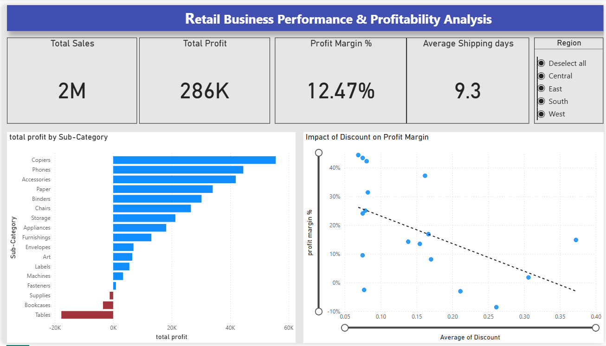

# Retail Business Performance & Profitability Analysis

## 📊 Dashboard Preview

## 📌 Business Overview & Problem Statement
Despite generating over **$2M in total sales**, the retail business experienced a surprisingly low net profit margin of **12.47%**. The objective of this project was to analyze transactional data, identify profit leaks, and evaluate the impact of discount strategies across product categories.

## 🛠️ Tech Stack & Tools Used
- **Power BI & DAX:** Interactive Dashboard, Data Modeling, Custom Measures (`Profit Margin %`, `Avg Shipping Days`).
- **Python (Pandas):** Initial Data Profiling, Outlier Detection, and Date Formatting.
- **SQL:** Aggregation Queries and Regional KPI Cross-Validation.

## 🔍 Key Business Insights
1. **Discount Leakage:** Discounts above **20%** consistently caused negative profit margins across most sub-categories.
2. **Loss Drivers:** **Tables** (-$17.7K) and **Bookcases** (-$3.4K) were the largest profit drainers due to excessive discounting and high shipping overheads.
3. **Top Performers:** **Copiers** (37.2% margin) and **Phones** were the most profitable products.

## 💡 Strategic Recommendations
- Cap maximum promotional discounts at **15%**.
- Revise baseline pricing and shipping policy for the Furniture category.
- Focus marketing spend on high-margin categories (Copiers and Technology).

## 📁 Repository Structure
